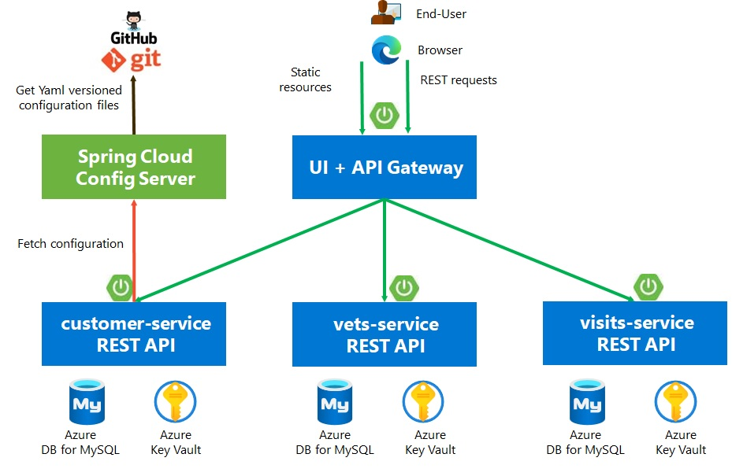

# Distributed version of the Spring PetClinic Sample Application deployed to Azure Container Apps

[](https://github.com/ezYakaEagle442/aca-java-petclinic-mic-srv/actions/workflows/maven-build.yml)
[](https://opensource.org/licenses/Apache-2.0)

[](https://github.com/ezYakaEagle442/aca-java-petclinic-mic-srv/actions/workflows/deploy-iac.yml)
[](https://opensource.org/licenses/Apache-2.0)

This microservices branch was initially derived from [AngularJS version](https://github.com/spring-petclinic/spring-petclinic-angular1) to demonstrate how to split sample Spring application into [microservices](http://www.martinfowler.com/articles/microservices.html).
To achieve that goal we use IaC with Azure Bicep, MS build of OpenJDK 11, GitHub Actions, Azure Container Registry, Azure Container Apps, Azure Key Vault, Azure Database for MySQL

See :
- the [ACA Micro-services Reference Architecture](https://learn.microsoft.com/en-us/azure/architecture/example-scenario/serverless/microservices-with-container-apps)
- [https://github.com/Azure-Samples/java-on-azure-examples/tree/main/containerapp](https://github.com/Azure-Samples/java-on-azure-examples/tree/main/containerapp)

# Pre-req

To install Azure Bicep locally, read [https://learn.microsoft.com/en-us/azure/azure-resource-manager/bicep/install](https://learn.microsoft.com/en-us/azure/azure-resource-manager/bicep/install)

See the [pre-requisites](https://learn.microsoft.com/en-us/azure/container-apps/get-started-existing-container-image?tabs=bash&pivots=container-apps-public-registry#prerequisites) and [the limitations](https://learn.microsoft.com/en-us/azure/container-apps/containers#limitations) in the ACA docs

# CI/CD

## Use GitHub Actions to deploy the Java microservices

About how to build the container image, read :
- [ACR doc](https://learn.microsoft.com/en-us/azure/container-registry/container-registry-java-quickstart) 
- [Optimize docker layers with Spring Boot](https://www.baeldung.com/docker-layers-spring-boot)

Read :
- [https://docs.github.com/en/actions/using-workflows/storing-workflow-data-as-artifacts](https://docs.github.com/en/actions/using-workflows/storing-workflow-data-as-artifacts)
- [https://docs.github.com/en/actions/automating-builds-and-tests/building-and-testing-java-with-maven](https://docs.github.com/en/actions/automating-builds-and-tests/building-and-testing-java-with-maven)
- [Overview of federated identity credentials in Azure Active Directory](https://learn.microsoft.com/en-us/graph/api/resources/federatedidentitycredentials-overview?view=graph-rest-1.0)

You have to specify all [KV secrets](./iac/bicep/modules/kv/kv_sec_key.bicep#L25) that will be then created in the GitHub Action [Azure Infra services deployment workflow](./.github/workflows/deploy-iac.yml#L140) :
- SPRING-DATASOURCE-PASSWORD
- SPRING-CLOUD-AZURE-TENANT-ID
- VM-ADMIN-PASSWORD

dash '-' are not supported in GH secrets, so the secrets must be named in GH with underscore '_'.
Also the '&' character in the SPRING_DATASOURCE_URL must be escaped with '\&'

Add the App secrets used by the Spring Config to your GH repo secrets / Actions secrets / Repository secrets / Add :

Secret Name	| Secret Value example
-------------:|:-------:
SPRING_DATASOURCE_PASSWORD | PUT YOUR PASSWORD HERE
SPRING_CLOUD_AZURE_TENANT_ID | PUT YOUR AZURE TENANT ID HERE
VM_ADMIN_PASSWORD | PUT YOUR PASSWORD HERE

```bash
LOCATION="westeurope"
RG_KV="rg-iac-kv777"
RG_APP="rg-iac-aca-petclinic-mic-srv"

az group create --name $RG_KV --location $LOCATION
az group create --name $RG_APP --location $LOCATION
```

A Service Principal is required for GitHub Action Runner, read [https://aka.ms/azadsp-cli](https://aka.ms/azadsp-cli)
```bash  
SPN_APP_NAME="gha_aca_run"

# /!\ In CloudShell, the default subscription is not always the one you thought ...
subName="set here the name of your subscription"
subName=$(az account list --query "[?name=='${subName}'].{name:name}" --output tsv)
echo "subscription Name :" $subName

SUBSCRIPTION_ID=$(az account list --query "[?name=='${subName}'].{id:id}" --output tsv)
SUBSCRIPTION_ID=$(az account show --query id -o tsv)
TENANT_ID=$(az account show --query tenantId -o tsv)
```

Add your AZURE_SUBSCRIPTION_ID, AZURE_TENANT_ID to your GH repo secrets / Actions secrets / Repository secrets

Read :
- [https://learn.microsoft.com/en-us/azure/developer/github/connect-from-azure](https://learn.microsoft.com/en-us/azure/developer/github/connect-from-azure?tabs=azure-cli%2Cwindows#create-a-service-principal-and-add-it-as-a-github-secret)
- [https://learn.microsoft.com/en-us/azure/developer/github/connect-from-azure?tabs=azure-cli%2Cwindows#use-the-azure-login-action-with-openid-connect](https://learn.microsoft.com/en-us/azure/developer/github/connect-from-azure?tabs=azure-cli%2Cwindows#use-the-azure-login-action-with-openid-connect)
- [https://learn.microsoft.com/en-us/azure/active-directory/develop/workload-identity-federation-create-trust?pivots=identity-wif-apps-methods-azp](https://learn.microsoft.com/en-us/azure/active-directory/develop/workload-identity-federation-create-trust?pivots=identity-wif-apps-methods-azp)


In the GitHub Action Runner, to allow the Service Principal used to access the Key Vault, execute the command below:
```sh
# SPN_PWD=$(az ad sp create-for-rbac --name $SPN_APP_NAME --skip-assignment --query password --output tsv)
# az ad sp create-for-rbac --name $SPN_APP_NAME --skip-assignment --sdk-auth

az ad app create --display-name $SPN_APP_NAME > aad_app.json

# Enterprise Application

# This is the unique ID of the Service Principal object associated with this application.
SPN_OBJECT_ID=$(az ad app list --show-mine --query "[?displayName=='${SPN_APP_NAME}'].{objectId:id}" -o tsv)

APPLICATION_ID=$(az ad app list --show-mine --query "[?displayName=='${SPN_APP_NAME}'].{appId:appId}" -o tsv)
```

Troubleshoot:
If you hit _["Error: : No subscriptions found for ***."](https://learn.microsoft.com/en-us/answers/questions/738782/no-subscription-found-for-function-during-azure-cl.html)_ , this is related to an IAM privilege in the subscription.


```sh
az ad sp create --id $APPLICATION_ID


SPN_APP_ID=$(az ad sp list --all --query "[?appDisplayName=='${SPN_APP_NAME}'].{appId:appId}" --output tsv)
#SPN_APP_ID=$(az ad sp list --show-mine --query "[?appDisplayName=='${SPN_APP_NAME}'].{appId:appId}" --output tsv)
# TENANT_ID=$(az ad sp list --show-mine --query "[?appDisplayName=='${SPN_APP_NAME}'].{t:appOwnerOrganizationId}" --output tsv)

az ad sp show --id $SPN_OBJECT_ID

# the assignee is an appId
az role assignment create --assignee $SPN_APP_ID --scope /subscriptions/${SUBSCRIPTION_ID}/resourceGroups/${RG_KV} --role contributor

# https://learn.microsoft.com/en-us/azure/key-vault/general/rbac-guide?tabs=azure-cli#azure-built-in-roles-for-key-vault-data-plane-operations

# "Key Vault Secrets User"
az role assignment create --assignee $SPN_APP_ID --scope /subscriptions/${SUBSCRIPTION_ID}/resourceGroups/${RG_KV} --role 4633458b-17de-408a-b874-0445c86b69e6

# "Key Vault Secrets Officer"
az role assignment create --assignee $SPN_APP_ID --scope /subscriptions/${SUBSCRIPTION_ID}/resourceGroups/${RG_KV} --role b86a8fe4-44ce-4948-aee5-eccb2c155cd7


# "DNS Zone Contributor"
# https://learn.microsoft.com/en-us/azure/role-based-access-control/built-in-roles#dns-zone-contributor
az role assignment create --assignee $SPN_APP_ID --scope /subscriptions/${SUBSCRIPTION_ID} --role befefa01-2a29-4197-83a8-272ff33ce314

# https://learn.microsoft.com/en-us/azure/role-based-access-control/built-in-roles#virtual-machine-contributor
# Virtual Machine Contributor has permission 'Microsoft.Network/publicIPAddresses/read'
#az role assignment create --assignee $SPN_APP_ID --scope /subscriptions/${SUBSCRIPTION_ID} --role 9980e02c-c2be-4d73-94e8-173b1dc7cf3c
#az role assignment create --assignee $SPN_OBJECT_ID --scope /subscriptions/${SUBSCRIPTION_ID} --role 9980e02c-c2be-4d73-94e8-173b1dc7cf3c

# Network-contributor: https://learn.microsoft.com/en-us/azure/role-based-access-control/resource-provider-operations#microsoftnetwork
az role assignment create --assignee $SPN_APP_ID --scope /subscriptions/${SUBSCRIPTION_ID} --role 4d97b98b-1d4f-4787-a291-c67834d212e7

# https://learn.microsoft.com/en-us/azure/role-based-access-control/role-assignments-portal#prerequisites
# /!\ To assign Azure roles, you must have: requires to have Microsoft.Authorization/roleAssignments/write and Microsoft.Authorization/roleAssignments/delete permissions, 
# such as User Access Administrator or Owner.
az role assignment create --assignee $SPN_APP_ID --scope /subscriptions/${SUBSCRIPTION_ID}/resourceGroups/${RG_KV} --role Owner
az role assignment create --assignee $SPN_APP_ID --scope /subscriptions/${SUBSCRIPTION_ID}/resourceGroups/${RG_APP} --role Owner

```

<span style="color:red">**RBAC Permission model is set on KV, the [pre-req](https://learn.microsoft.com/en-us/azure/key-vault/general/rbac-guide?tabs=azure-cli#prerequisites) requires to have Microsoft.Authorization/roleAssignments/write and Microsoft.Authorization/roleAssignments/delete permissions, such as User Access Administrator or Owner.

[https://learn.microsoft.com/en-us/azure/role-based-access-control/role-assignments-portal#prerequisites](https://learn.microsoft.com/en-us/azure/role-based-access-control/role-assignments-portal#prerequisites)
To assign Azure roles, you must have: requires to have Microsoft.Authorization/roleAssignments/write and Microsoft.Authorization/roleAssignments/delete permissions, such as User Access Administrator or Owner.
**</span>

<span style="color:red">**"Key Vault Secrets User" [built-in role](https://learn.microsoft.com/en-us/azure/key-vault/general/rbac-guide?tabs=azure-cli#azure-built-in-roles-for-key-vault-data-plane-operations) read secret contents including secret portion of a certificate with private key. Only works for key vaults that use the 'Azure role-based access control' permission model.**
</span>


```sh
export CREDENTIAL_NAME="gha_aca_run"
export GH_USER_NAME="yourGitHubAccount"
export SUBJECT="repo:$GH_USER_NAME/aca-java-petclinic-mic-srv:ref:refs/heads/main" # "repo:organization/repository:environment:Production"
export DESCRIPTION="GitHub Action Runner for Petclinic ACA demo"

az rest --method POST --uri 'https://graph.microsoft.com/beta/applications/$SPN_OBJECT_ID/federatedIdentityCredentials' --body '{"name":"$CREDENTIAL_NAME","issuer":"https://token.actions.githubusercontent.com","subject":"$SUBJECT","description":"$DESCRIPTION","audiences":["api://AzureADTokenExchange"]}'

```

Add AZURE_CLIENT_ID (value of $SPN_APP_ID), AZURE_TENANT_ID, and AZURE_SUBSCRIPTION_ID as secrets to your GH repo secrets / Actions secrets / Repository secrets

<span style="color:red">**Be aware that at this stage KV is not created yet, it must exist first to set-policy**
[enableRbacAuthorization is true in KV](./iac/bicep/modules/kv/kv.bicep#L61), the key vault will use RBAC for authorization of data actions, and the [access policies specified in vault properties](https://docs.microsoft.com/en-us/azure/templates/microsoft.keyvault/vaults/accesspolicies?tabs=bicep) will be ignored</span>

If enableRbacAuthorization was set to false, you would have to follow the here under step to add access policy for the Service Principal.
```sh
KV_NAME="kv-petcliaca42"
az keyvault set-policy -n $KV_NAME --secret-permissions get list --spn $SPN_ID
```

Finally Create a GH [PAT](https://docs.github.com/en/authentication/keeping-your-account-and-data-secure/creating-a-personal-access-token) "PKG_PAT" that can be use to [publish ACA Revisions with GHA](https://learn.microsoft.com/en-us/azure/container-apps/github-actions-cli?tabs=bash#authentication), [publish packages](./.github/workflows/maven-build.yml#L101) and [delete packages](./.github/workflows/delete-all-artifacts.yml#)

<span style="color:red">**Your GitHub personal access token needs to have the workflow scope selected. You need at least delete:packages and read:packages scopes to delete a package. You need contents: read and packages: write permissions to publish and download artifacts**</span>


To avoid to hit the error below : 
```console
"The subscription is not registered to use namespace 'Microsoft.KeyVault'. See https://aka.ms/rps-not-found for how to register subscriptions.\",\r\n    \"details\": [\r\n      ***\r\n        \"code\": \"MissingSubscriptionRegistration\"
```

Read the [docs](https://learn.microsoft.com/en-us/azure/azure-resource-manager/troubleshooting/error-register-resource-provider?tabs=azure-cli)
Just run :
```sh

az provider list --output table
az provider list --query "[?registrationState=='Registered']" --output table
az provider list --query "[?namespace=='Microsoft.KeyVault']" --output table
az provider list --query "[?namespace=='Microsoft.OperationsManagement']" --output table

az provider register --namespace Microsoft.KeyVault
az provider register --namespace Microsoft.ContainerRegistry
az provider register --namespace Microsoft.ContainerService
az provider register --namespace Microsoft.OperationalInsights 
az provider register --namespace Microsoft.DBforMySQL
az provider register --namespace Microsoft.DBforPostgreSQL
az provider register --namespace Microsoft.Compute 
az provider register --namespace Microsoft.AppConfiguration       
az provider register --namespace Microsoft.AppPlatform
az provider register --namespace Microsoft.EventHub  
az provider register --namespace Microsoft.Kubernetes 
az provider register --namespace Microsoft.KubernetesConfiguration
az provider register --namespace Microsoft.Kusto  
az provider register --namespace Microsoft.ManagedIdentity
az provider register --namespace Microsoft.Monitor
az provider register --namespace Microsoft.OperationsManagement
az provider register --namespace Microsoft.Network  
az provider register --namespace Microsoft.ServiceBus
az provider register --namespace Microsoft.Storage
az provider register --namespace Microsoft.Subscription

```

## Pipelines

See GitHub Actions :
- [Deploy the Azure Infra services workflow](./.github/workflows/deploy-iac.yml)
- [Maven Backends Build workflow](./.github/workflows/maven-build.yml)
- [Maven UI Build workflow](./.github/workflows/maven-build-ui.yml)
- [Java Apps Config-Server Deploy workflow](./.github/workflows/deploy-app-cfg-srv.yml)
- [Java Apps Backends Deploy workflow](./.github/workflows/deploy-app-svc.yml)
- [Java Apps UI Deploy workflow](./.github/workflows/deploy-app-ui.yml)
- [Delete ALL the Azure Infra services workflow, except KeyVault](./.github/workflows/delete-rg.yml)


<span style="color:red">****</span>

Workflow Design

The Workflow run the steps in this in this order :

```
├── Deploy the Azure Infra services workflow ./.github/workflows/deploy-iac.yml
│   ├── Authorize local IP to access the Azure Key Vault ./.github/workflows/deploy-iac.yml#L151
│   ├── Create the secrets ./.github/workflows/deploy-iac.yml#L155
│   ├── Disable local IP access to the Key Vault ./.github/workflows/deploy-iac.yml#L206
│   ├── Deploy the pre-req ./.github/workflows/deploy-iac.yml#L239
│       ├── Apply Apps Identity Role Asssignments for KV ./.github/workflows/deploy-iac.yml#L272
│   ├── Whitelist ACA Env. OutboundIP to KV and MySQL ./.github/workflows/deploy-iac.yml#L289
│   ├── Call Maven Build ./.github/workflows/deploy-iac.yml#L339
│       ├── Maven Build ./.github/workflows/maven-build.yml#L143
│       ├── Publish the Maven package ./.github/workflows/maven-build.yml#L166
│       ├── Check all Jar artifacts ./.github/workflows/maven-build.yml#L177
│       ├── Build image and push it to ACR ./.github/workflows/maven-build.yml#L246
│   ├── Call Maven Build-UI ./.github/workflows/deploy-iac.yml#L346
│   ├── Deploy Backend Services ./.github/workflows/deploy-iac.yml#L352
│       ├── Deploy Config-server calling ./.github/workflows/deploy-app-cfg-srv.yml
│       ├── Deploy Backend services calling ./.github/workflows/deploy-app-svc.yml
│       ├── Deploy the UI calling ./.github/workflows/deploy-app-ui.yml
```

You need to set your own param values in :
- [Azure Infra services deployment workflow](./.github/workflows/deploy-iac.yml#L13)
```sh
env:
  APP_NAME: petcliaca
  LOCATION: westeurope
  RG_KV: rg-iac-kv42 # RG where to deploy KV
  RG_APP: rg-iac-aca-petclinic-mic-srv # RG where to deploy the other Azure services: ACA, ACA Env., MySQL, etc.
  ACA_ENV_NAME: aca-env-pub # ACA Environment name. Ex 'aca-env-pub' or 'aca-env-corp' when deployed to your VNet
  KV_NAME: kv-petcliaca42 # The name of the KV, must be UNIQUE. A vault name must be between 3-24 alphanumeric characters
  
  AZURE_CONTAINER_REGISTRY: acrpetcliaca # The name of the ACR, must be UNIQUE. The name must contain only alphanumeric characters, be globally unique, and between 5 and 50 characters in length.
  REPOSITORY: petclinic                  # set this to your ACR repository

  # GitHub Actions settings
  GHA_SETTINGS_CFG_REGISTRY_URL: acrpetcliaca.azurecr.io
  GHA_SETTINGS_CFG_REPO_URL: https://github.com/ezYakaEagle442/aca-java-petclinic-mic-srv
  
  # https://learn.microsoft.com/en-us/azure/key-vault/secrets/secrets-best-practices#secrets-rotation
  # Because secrets are sensitive to leakage or exposure, it's important to rotate them often, at least every 60 days. 
  # Expiry date in seconds since 1970-01-01T00:00:00Z. Ex: 1672444800 ==> 31/12/2022'
  SECRET_EXPIRY_DATE: 1672444800
```

- [Maven Build workflow](./.github/workflows/maven-build.yml)
```sh
  AZURE_CONTAINER_REGISTRY: acrpetcliaca # The name of the ACR, must be UNIQUE. The name must contain only alphanumeric characters, be globally unique, and between 5 and 50 characters in length.
  REGISTRY_URL: acrpetcliaca.azurecr.io  # set this to the URL of your registry
  REPOSITORY: petclinic                  # set this to your ACR repository
  PROJECT_NAME: petclinic                # set this to your project's name
  KV_NAME: kv-petcliaca42               # The name of the KV, must be UNIQUE. A vault name must be between 3-24 alphanumeric characters
  
  RG_KV: rg-iac-kv42 # RG where to deploy KV
  RG_APP: rg-iac-aca-petclinic-mic-srv # RG where to deploy the other Azure services: ACA, ACA Env., MySQL, etc.
```


- [Maven Build workflow for the UI](./.github/workflows/maven-build-ui.yml)
```sh
  AZURE_CONTAINER_REGISTRY: acrpetcliaca # The name of the ACR, must be UNIQUE. The name must contain only alphanumeric characters, be globally unique, and between 5 and 50 characters in length.
  REGISTRY_URL: acrpetcliaca.azurecr.io  # set this to the URL of your registry
  REPOSITORY: petclinic                  # set this to your ACR repository
  PROJECT_NAME: petclinic                # set this to your project's name
  KV_NAME: kv-petcliaca42               # The name of the KV, must be UNIQUE. A vault name must be between 3-24 alphanumeric characters
  
  RG_KV: rg-iac-kv42 # RG where to deploy KV
  RG_APP: rg-iac-aca-petclinic-mic-srv # RG where to deploy the other Azure services: ACA, ACA Env., MySQL, etc.
```

Once you commit, then push your code update to your repo, it will trigger a Maven build which you need to can CANCELL from https://github.com/USERNAME/aca-java-petclinic-mic-srv/actions/workflows/maven-build.yml the first time you trigger the workflow, anyway it will fail because the ACR does not exist yet and the docker build will fail to push the Images.

Note: the GH Hosted Runner / [Ubuntu latest image has already Azure CLI installed](https://github.com/actions/runner-images/blob/main/images/linux/Ubuntu2204-Readme.md#cli-tools)

# Deploy Azure Container Apps and the petclinic microservices Apps with IaC

You can read the [Bicep section](iac/bicep/README.md) but you do not have to run it through CLI, instead you can manually trigger the GitHub Action [deploy-iac.yml](./.github/workflows/deploy-iac.yml), see the Workflow in the next [section](#iac-deployment-flow)

This network can be managed or custom (pre-configured by the user beforehand). In either case, the environment has dependencies on services outside of that virtual network. For a list of these dependencies
see the [ACA doc](https://learn.microsoft.com/en-us/azure/container-apps/firewall-integration#outbound-fqdn-dependencies)

## IaC deployment flow

By default the Azure Container Apps [Environment](https://learn.microsoft.com/en-us/azure/container-apps/networking) is deployed as external resources and are available for public requests, i.e not deployed to a VNet. 
(External environments are deployed with a virtual IP on an external, public facing IP address.)

- [Bicep ](./iac/bicep/modules/aca/acaPublicEnv.bicep#L36)
```code
param deployToVNet bool = false
```


```
├── Create RG
│
├── Create KV ./iac/bicep/modules/kv/kv.bicep
│   ├── Create KV ./iac/bicep/modules/kv/kv.bicep#L46
├── Create pre-requisites ./iac/bicep/pre-req.bicep
│   ├── Create logAnalyticsWorkspace ./iac/bicep/pre-req.bicep#L102
│   ├── Create appInsights ./iac/bicep/pre-req.bicep#L119
│   ├── Call ACR Module ./iac/bicep/pre-req.bicep#L138
│   ├── Call ACA Module defaultPublicManagedEnvironment ./iac/bicep/pre-req.bicep#L156
│   ├── Call MySQL Module ./iac/bicep/pre-req.bicep#L173
├── Run the Main ./iac/bicep/petclinic-apps.bicep
│   ├── Call ACA Module ./iac/bicep/modules/aca/aca.bicep#215
│   ├── Call roleAssignments Module ./iac/bicep/petclinic-apps.bicep#270
│   └── Call KV Access Policies ./iac/bicep/petclinic-apps.bicep#357
```

- [Azure Infra services deployment workflow](./.github/workflows/deploy-iac.yml#L13)
```code
DEPLOY_TO_VNET: false
```

To Deploy the Apps into your VNet, see [Deployment to VNet section](#deployment-to-vnet)

<span style="color:red">**Be aware that the MySQL DB is NOT deployed in a VNet but network FireWall Rules are Set. So ensure to allow ACA Outbound IP addresses or check the option "Allow public access from any Azure service within Azure to this server" in the Azure Portal / your MySQL DB / Networking / Firewall rules. 
enableRbacAuthorization is set to true in KV (Preview feature), the key vault will use RBAC for authorization of data actions, and the access policies specified in vault properties will be ignored**</span>

## Security
### secret Management
Azure Key Vault integration is implemented through Spring Cloud for Azure

Read : 

- [https://learn.microsoft.com/en-us/azure/developer/java/spring-framework/configure-spring-boot-starter-java-app-with-azure-key-vault](https://learn.microsoft.com/en-us/azure/developer/java/spring-framework/configure-spring-boot-starter-java-app-with-azure-key-vault)
- [https://microsoft.github.io/spring-cloud-azure/current/reference/html/index.html#advanced-usage]https://microsoft.github.io/spring-cloud-azure/current/reference/html/index.html#advanced-usage)
- [https://learn.microsoft.com/en-us/azure/container-apps/manage-secrets?tabs=arm-template](https://learn.microsoft.com/en-us/azure/container-apps/manage-secrets?tabs=arm-template)
- [https://github.com/Azure/azure-sdk-for-java/issues/28310](https://github.com/Azure/azure-sdk-for-java/issues/28310)
- [Maven Project parent pom.xml](pom.xml#L168)

The Config-server does use the config declared on the repo at [https://github.com/ezYakaEagle442/aca-cfg-srv/blob/main/application.yml](https://github.com/ezYakaEagle442/aca-cfg-srv/blob/main/application.yml) and uses a [User-Assigned Managed Identity](https://learn.microsoft.com/en-us/azure/active-directory/managed-identities-azure-resources/overview#managed-identity-types) to be able to read secrets from KeyVault.

If you face any issue, see the [troubleshoot section](#key-vault-troubleshoot-with-USER-Assigned-MI)

## Deployment to VNet

You can your Apps into your own VNet when creating the Azure Container Apps Environment, see:
- [Bicep ](./iac/bicep/modules/aca/acaVNetEnv.bicep#L71), setting its [vnetConfiguration](./iac/bicep/modules/aca/acaVNetEnv.bicep#L84)

```code
param deployToVNet bool = true
```
[Azure Infra services deployment workflow](./.github/workflows/deploy-iac-to-vnet.yml#L16)
```code
DEPLOY_TO_VNET: true
```


```
├── Create RG
│
├── Create KV ./iac/bicep/modules/kv/kv.bicep
│   ├── Create KV ./iac/bicep/modules/kv/kv.bicep#L46
├── Create pre-requisites ./iac/bicep/pre-req-deploy-to-vnet
│   ├── Create logAnalyticsWorkspace ./iac/bicep/pre-req.bicep#L102
│   ├── Create appInsights ./iac/bicep/pre-req.bicep#L119
│   ├── Call ACR Module ./iac/bicep/pre-req.bicep#L138
│   ├── Call ACA Module defaultPublicManagedEnvironment ./iac/bicep/pre-req.bicep#L156
│   ├── Call VNet Module ./iac/bicep/pre-req-deploy-to-vnet.bicep#L150
│   ├── Call ACA Module corpManagedEnvironment ./iac/bicep/pre-req-deploy-to-vnet#L171
│   ├── Call MySQL Module ./iac/bicep/pre-req-deploy-to-vnet.bicep#L196
│   ├── Call DNS Private-Zone Module ./iac/bicep/pre-req-deploy-to-vnet.bicep#L212
│   ├── Call ClientVM Module ./iac/bicep/pre-req-deploy-to-vnet.bicep#L224
├── Run the Main ./iac/bicep/petclinic-apps.bicep
│   ├── Call ACA Module ./iac/bicep/modules/aca/aca.bicep#215
│   ├── Call roleAssignments Module ./iac/bicep/petclinic-apps.bicep#270
│   └── Call KV Access Policies ./iac/bicep/petclinic-apps.bicep#357
```


### DNS Management

When configuring Azure Container Apps Environment to your VNet, a Private-DNS Zone is created during the [Bicep pre-req deployment](./iac/bicep/pre-req-deploy-to-vnet.bicep#L212), see [./iac/bicep/modules/aca/dns.bicep](./iac/bicep/modules/aca/dns.bicep#L34)

/!\ IMPORTANT: Set location to 'global' instead of '${location}'. This is because Azure DNS is a global service. 
Otherwise you will hit this error:
```sh
"MissingRegistrationForLocation. "The subscription is not registered for the resource type 'privateDnsZones' in the location 'westeurope' 
```

```sh
resource acaPrivateDnsZone 'Microsoft.Network/privateDnsZones@2020-06-01' = {
  //<env>.<RANDOM>.<REGION>.azurecontainerapps.io. Ex: https://aca-test-vnet.wittyhill-01dfb8c1.westeurope.azurecontainerapps.io
  name: '${location}.azurecontainerapps.io' // 'private.azurecontainerapps.io'
  location: 'global'  
}
```
### Client VM
When configuring Azure Container Apps Environment to your VNet, a JumpOff client VM is created during the [Bicep pre-req deployment](./iac/bicep/pre-req-deploy-to-vnet.bicep#L224), see [./iac/bicep/aca/client-vm.bicep](./iac/bicep/modules/aca/client-vm.bicep#L129)

## App Container syntax

command	is the container's startup command.	Equivalent to Docker's entrypoint field.
See the [docs](https://learn.microsoft.com/en-us/azure/container-apps/containers#configuration)

When allocating resources, the total amount of CPUs and memory requested for all the containers in a container app must add up to one of the [following combinations](https://learn.microsoft.com/en-us/azure/container-apps/containers#configuration).

vCPUs (cores)	| Memory
-------------:|:-------:
0.25 	| 0.5Gi
0.5	  | 1.0Gi
0.75	| 1.5Gi
1.0	  | 2.0Gi
1.25	| 2.5Gi
1.5		| 3.0Gi
1.75	| 3.5Gi
2.0		| 4.0Gi


# Starting services locally without Docker

Quick local test just to verify that the jar files can be run (the routing will not work out of a K8S cluster, and also the apps will fail to start as soon as management port 8081 will be already in use by config server ...) : 

<span style="color:red">**/!\ IMPORTANT WARNING: projects must be built with -Denv=cloud  EXCEPT for api-gateway**</span>

```sh
 mvn clean package -DskipTests -Denv=cloud
java -jar spring-petclinic-config-server\target\aca-spring-petclinic-config-server-2.6.13.jar --server.port=8888
java -jar spring-petclinic-admin-server\target\aca-spring-petclinic-admin-server-2.6.13.jar --server.port=9090
java -jar spring-petclinic-visits-service\target\aca-spring-petclinic-visits-service-2.6.13.jar --server.port=8082 # --spring.profiles.active=docker
java -jar spring-petclinic-vets-service\target\aca-spring-petclinic-vets-service-2.6.13.jar --server.port=8083
java -jar spring-petclinic-customers-service\target\aca-spring-petclinic-customers-service-2.6.13.jar --server.port=8084
java -jar spring-petclinic-api-gateway\target\aca-spring-petclinic-api-gateway-2.6.13.jar --server.port=8085
```

Note: tip to verify the dependencies
```sh
mvn dependency:tree
mvn dependency:analyze-duplicate
```

To learn more about maven, read :
- [https://www.baeldung.com/maven](https://www.baeldung.com/maven)
- [https://www.baeldung.com/maven-duplicate-dependencies](https://www.baeldung.com/maven-duplicate-dependencies)
- [https://www.baeldung.com/maven-multi-module](https://www.baeldung.com/maven-multi-module)

Every microservice is a Spring Boot application and can be started locally. 
Please note that supporting services (Config Server) must be started before any other application (Customers, Vets, Visits and API).
Startup Admin server is optional.
If everything goes well, you can access the following services at given location:
* AngularJS frontend (API Gateway) - http://localhost:8080
* Admin Server (Spring Boot Admin) - http://localhost:9090


The `main` branch uses an MS openjdk/jdk:11-mariner Docker base.

```sh
#acr_usr=$(az deployment group show -g ${{ env.RG_APP }} -n ${{ env.AZURE_CONTAINER_REGISTRY }} --query properties.outputs.acrRegistryUsr.value | tr -d '"')
#acr_pwd=$(az deployment group show -g ${{ env.RG_APP }} -n ${{ env.AZURE_CONTAINER_REGISTRY }} --query properties.outputs.acrRegistryPwd.value | tr -d '"')
#az acr login --name ${{ env.REGISTRY_URL }} -u $acr_usr -p $acr_pwd

set -euo pipefail
access_token=$(az account get-access-token --query accessToken -o tsv)

refresh_token=$(curl https://${{ env.REGISTRY_URL }}/oauth2/exchange -v -d "grant_type=access_token&service=${{ env.REGISTRY_URL }}&access_token=$access_token" | jq -r .refresh_token)

refresh_token=$(curl https://acrpetcliaca.azurecr.io/oauth2/exchange -v -d "grant_type=access_token&service=acrpetcliaca.azurecr.io&access_token=$access_token" | jq -r .refresh_token)

# docker login ${{ env.REGISTRY_URL }} -u 00000000-0000-0000-0000-000000000000 --password-stdin <<< "$refresh_token"

docker build --build-arg --no-cache -t "petclinic-admin-server" -f "./docker/petclinic-admin-server/Dockerfile" .
docker tag petclinic-admin-server acrpetcliaca.azurecr.io/petclinic/petclinic-admin-server
az acr login --name acrpetcliaca.azurecr.io -u $acr_usr -p $acr_pwd
az acr build --registry acrpetcliaca -g  rg-iac-aca-petclinic-mic-srv  -t petclinic/adm-test:test --file "./docker/petclinic-admin-server/Dockerfile" .
docker push acrpetcliaca.azurecr.io/petclinic/petclinic-admin-server
docker pull acrpetcliaca.azurecr.io/petclinic/petclinic-admin-server
docker image ls
```

Note: the Docker files must be named Dockerfile
See [https://github.com/Azure/azure-cli-extensions/issues/5041](https://github.com/Azure/azure-cli-extensions/issues/5041)

# Understanding the Spring Petclinic application

[See the presentation of the Spring Petclinic Framework version](http://fr.slideshare.net/AntoineRey/spring-framework-petclinic-sample-application)

[A blog bost introducing the Spring Petclinic Microsevices](http://javaetmoi.com/2018/10/architecture-microservices-avec-spring-cloud/) (french language)

You can then access petclinic here: http://localhost:8080/


**Architecture diagram of the Spring Petclinic Microservices**



The UI code is located at spring-petclinic-api-gateway\src\main\resources\static\scripts.

The Spring Zuul(Netflix Intelligent Routing) config at https://github.com/ezYakaEagle442/aca-cfg-srv/blob/main/api-gateway.yml has been deprecated and replaced by the Spring Cloud Gateway.

The Spring Cloud Gateway routing is configured at [spring-petclinic-api-gateway/src/main/resources/application.yml](spring-petclinic-api-gateway/src/main/resources/application.yml)

The API Gateway Controller is located at [spring-petclinic-api-gateway/src/main/java/org/springframework/samples/petclinic/api/boundary/web/ApiGatewayController.java](spring-petclinic-api-gateway/src/main/java/org/springframework/samples/petclinic/api/boundary/web/ApiGatewayController.java)

Note: The Spring Cloud Discovery Server is NOT deployed as the underlying K8S/AKS discovery/DNS service is used.
see :
- [https://spring.io/guides/gs/service-registration-and-discovery](https://spring.io/guides/gs/service-registration-and-discovery/)
- [https://spring.io/projects/spring-cloud-netflix](https://spring.io/projects/spring-cloud-netflix)
- [https://kubernetes.io/docs/tasks/administer-cluster/dns-debugging-resolutionhttps://kubernetes.io/docs/tasks/administer-cluster/dns-debugging-resolution/
- [https://kubernetes.io/docs/concepts/services-networking/dns-pod-service/](https://kubernetes.io/docs/concepts/services-networking/dns-pod-service/)

**Specifically required when deploying the Petclinic App to ACA**  see [ACA Internal routing section](#aca-internal-routing)

The Git repo URL used by Spring config is set in spring-petclinic-config-server/src/main/resources/application.yml

If you want to know more about the Spring Boot Admin server, you might be interested in [https://github.com/codecentric/spring-boot-admin](https://github.com/codecentric/spring-boot-admin)


<span style="color:red">For Learning purpose the App uses Key Vault to fetch secrets like the DB password but if would be even better using Passwordless Features: **[https://aka.ms/delete-passwords](https://learn.microsoft.com/en-us/azure/developer/intro/passwordless-overview)**</span>


## Understand the Spring Cloud Config

Read [https://learn.microsoft.com/en-us/azure/spring-apps/quickstart-setup-config-server?tabs=Azure-portal&pivots=programming-language-java](https://learn.microsoft.com/en-us/azure/spring-apps/quickstart-setup-config-server?tabs=Azure-portal&pivots=programming-language-java)


Spring Boot is a framework aimed to help developers to easily create and build stand-alone, production-grade Spring based Applications that you can “just run”.

Spring Cloud Config provides server and client-side support for externalized configuration in a distributed system. With the Spring Cloud Config Server you have a central place to manage external properties for applications across all environments.

Spring Cloud Config Server is a centralized service that via HTTP provides all the applications configuration (name-value pairs or equivalent YAML content). The server is embeddable in a Spring Boot application, by using the @EnableConfigServer annotation.

In other words, the Spring Cloud Config Server is simply a Spring Boot application, configured as a Spring Cloud Config Server, and that is able to retrieve the properties from the configured property source. The property source can be a Git repository, svn or Consul service. 

A Spring Boot application properly configured, can take immediate advantage of the Spring Config Server. It also picks up some additional useful features related to Environment change events. Any Spring Boot application can easily be configured as a Spring Cloud Config Client.


## Containerize your Java applications

See the [Azure doc](https://learn.microsoft.com/en-us/azure/developer/java/containers/overview)
Each micro-service is containerized using a Dockerfile. Example at [./docker/petclinic-customers-service/Dockerfile](./docker/petclinic-customers-service/Dockerfile)

About how to build the container image, read [ACR doc](https://learn.microsoft.com/en-us/azure/container-registry/container-registry-java-quickstart) 


## Database configuration

In its default configuration, Petclinic uses an in-memory database (HSQLDB) which gets populated at startup with data.
A similar setup is provided for MySql in case a persistent database configuration is needed.
Dependency for Connector/J, the MySQL JDBC driver is already included in the `pom.xml` files.


### Set MySql connection String

You need to reconfigure the MySQL connection string with your own settings (you can get it from the Azure portal / petcliaca-mysql-server / Connection strings / JDBC):
In the [spring-petclinic-microservices-config/blob/main/application.yml](https://github.com/ezYakaEagle442/aca-cfg-srv/blob/main/application.yml) :
```
spring:
  config:
    activate:
      on-profile: mysql
  datasource:
    schema: classpath*:db/mysql/schema.sql
    data: classpath*:db/mysql/data.sql

    # url: jdbc:mysql://localhost:3306/petclinic?useSSL=false
    # url: jdbc:mysql://petclinic.mysql.database.azure.com:3306/petclinic?useSSL=true
    # https://dev.mysql.com/doc/connector-j/5.1/en/connector-j-reference-using-ssl.html
    # url: jdbc:mysql://petclinic.mysql.database.azure.com:3306/petclinic?useSSL=true&requireSSL=true&enabledTLSProtocols=TLSv1.2&verifyServerCertificate=true
    # https://learn.spring.io/spring-boot/docs/2.7.3/reference/html/application-properties.html#appendix.application-properties.data
    
    # spring.datasource.password will be automatically injected from KV secrets SPRING-DATASOURCE-PASSWORD
    # url: jdbc:mysql://${SPRING-DATASOURCE-URL}:3306/${MYSQL-DATABASE-NAME}?useSSL=true&requireSSL=true&enabledTLSProtocols=TLSv1.2&verifyServerCertificate=true    
    # username: ${SPRING-DATASOURCE-USERNAME}
    # password: ${SPRING-DATASOURCE-PASSWORD}  
    initialization-mode: NEVER # ALWAYS
    # https://javabydeveloper.com/spring-boot-loading-initial-data/
    platform: mysql
    #driver-class-name: com.mysql.jdbc.Driver
```
In fact the spring.datasource.password will be automatically injected from KV secrets SPRING-DATASOURCE-PASSWORD using the config below in each micro-service :
example for Customers-Service [spring-petclinic-customers-service/src/main/resources/application.yml](spring-petclinic-customers-service/src/main/resources/application.yml)

```
spring:
  cloud:
    azure:
      profile: # spring.cloud.azure.profile
        # subscription-id:
        tenant-id: ${AZURE_TENANT_ID}
      credential:
        managed-identity-enabled: true        
      keyvault:
        secret:
          enabled: true
          property-sources:
            - name: kv-cfg-XXX # KV Config for each App XXX
              endpoint: ${SPRING_CLOUD_AZURE_KEY_VAULT_ENDPOINT}
              credential:
                managed-identity-enabled: true
                client-id: ${XXXX_SVC_APP_IDENTITY_CLIENT_ID}
---
```

You can check the DB connection with this [sample project](https://github.com/Azure-Samples/java-on-azure-examples/tree/main/databases/mysql/get-country).


### Use the Spring 'mysql' profile

To use a MySQL database, you have to start 3 microservices (`visits-service`, `customers-service` and `vets-services`)
with the `mysql` Spring profile. Add the `--spring.profiles.active=mysql` as programm argument.

In the `application.yml` of the [Configuration repository], set the `initialization-mode` to `never`  ( or `ALWAYS`).

If you are running the microservices with Docker, you have to add the `mysql` profile into the (Dockerfile)[docker/Dockerfile]:
```
ENV SPRING_PROFILES_ACTIVE docker,mysql
```
 

 All MySQL flexible-server parameters are set in the [sql-load workflow](./.github/workflows/sql-load.yml) called by the [IaC deployment workflow](./.github/workflows/deploy-iac.yml#L484)

## Observability

Read the Application Insights docs : 

- [https://learn.microsoft.com/en-us/azure/azure-monitor/app/java-in-process-agent](https://learn.microsoft.com/en-us/azure/azure-monitor/app/java-in-process-agent)
- [https://learn.microsoft.com/en-us/azure/azure-monitor/app/java-spring-boot#spring-boot-via-docker-entry-point](https://learn.microsoft.com/en-us/azure/azure-monitor/app/java-spring-boot#spring-boot-via-docker-entry-point)
- [https://learn.microsoft.com/en-us/azure/azure-monitor/app/java-in-process-agent#set-the-application-insights-connection-string](https://learn.microsoft.com/en-us/azure/azure-monitor/app/java-in-process-agent#set-the-application-insights-connection-string)
- [https://techcommunity.microsoft.com/t5/apps-on-azure-blog/observability-with-azure-container-apps/ba-p/3627909](https://techcommunity.microsoft.com/t5/apps-on-azure-blog/observability-with-azure-container-apps/ba-p/3627909)
- [https://techcommunity.microsoft.com/t5/apps-on-azure-blog/bg-p/AppsonAzureBlog](https://techcommunity.microsoft.com/t5/apps-on-azure-blog/bg-p/AppsonAzureBlog)
- [https://github.com/microsoft/ApplicationInsights-Java](https://github.com/microsoft/ApplicationInsights-Java)
- [https://github.com/microsoft/AzureMonitorCommunity](https://github.com/microsoft/AzureMonitorCommunity)

The config files are located in each micro-service at src/main/resources/applicationinsights.json
The Java agent is downloaded in the App container in /tmp/app, you can have a look at a Docker file, example at [./docker/petclinic-customers-service/Dockerfile](./docker/petclinic-customers-service/Dockerfile)

<span style="color:red">**[By default, Application Insights Java 3.x expects the configuration file to be named applicationinsights.json and to be located in the same directory as applicationinsights-agent-3.x.x.jar.](https://learn.microsoft.com/en-us/azure/azure-monitor/app/java-standalone-config#configuration-file-path)**</span>

You can specify your own configuration file path by using one of these two options:
- APPLICATIONINSIGHTS_CONFIGURATION_FILE environment variable
- applicationinsights.configuration.file Java system property

In our configuration, in the containers the applicationinsights.json is located at BOOT-INF/classes/applicationinsights.json
so we must set APPLICATIONINSIGHTS_CONFIGURATION_FILE=BOOT-INF/classes/applicationinsights.json

The Application Insights [Connection String](./iac/bicep/aca/main.bicep#L234) [set in the Apps](./iac/bicep/aca/aca.bicep#L736) is retrieved from the [AppInsights Resource](./iac/bicep/aca/pre-req.bicep#L126) created at the pre-req provisionning stage.


### Use the Petclinic application and make a few REST API calls

Open the Petclinic application and try out a few tasks - view pet owners and their pets, 
vets, and schedule pet visits:

```bash
open https://aca-petcliaca-api-gateway-<CONTAINER_APP_ENV_DNS_SUFFIX>/
```

You can also use your browser or  `curl` the REST API exposed by the Petclinic application. 
The admin REST API allows you to create/update/remove items in Pet Owners, Pets, Vets and Visits.
You can run the following curl commands:

URL ex:
- https://aca-petcliaca-api-gateway.bluepebble-754d2322.francecentral.azurecontainerapps.io/
- http://aca-petcliaca-customers-service--0uvglgf.bluepebble-754d2322.francecentral.azurecontainerapps.io/owners/3/pets/4
- https://aca-petcliaca-visits-service--l1fs5w2.bluepebble-754d2322.francecentral.azurecontainerapps.io/owners/6/pets/8/visits
- https://aca-petcliaca-vets-service--mxki9ff.bluepebble-754d2322.francecentral.azurecontainerapps.io/vets

<CONTAINER_APP_ENV_DNS_SUFFIX>=<GUID>.<CONTAINER_APP_ENV_DNS_SUFFIX>
ex: mxki9ff.bluepebble-754d2322.francecentral.azurecontainerapps.io

```bash
curl -X GET https://aca-petcliaca-api-gateway-<CONTAINER_APP_ENV_DNS_SUFFIX>/api/customer/owners
curl -X GET https://aca-petcliaca-api-gateway-<CONTAINER_APP_ENV_DNS_SUFFIX>/api/customer/owners/4
curl -X GET https://aca-petcliaca-api-gateway-<CONTAINER_APP_ENV_DNS_SUFFIX>/api/customer/owners/ 
curl -X GET https://aca-petcliaca-api-gateway-<CONTAINER_APP_ENV_DNS_SUFFIX>/api/customer/petTypes
curl -X GET https://aca-petcliaca-api-gateway-<CONTAINER_APP_ENV_DNS_SUFFIX>/api/customer/owners/3/pets/4
curl -X GET https://aca-petcliaca-api-gateway-<CONTAINER_APP_ENV_DNS_SUFFIX>/api/customer/owners/6/pets/8/
curl -X GET https://aca-petcliaca-api-gateway-<CONTAINER_APP_ENV_DNS_SUFFIX>/api/vet/vets
curl -X GET https://aca-petcliaca-api-gateway-<CONTAINER_APP_ENV_DNS_SUFFIX>/api/visit/owners/6/pets/8/visits
curl -X GET https://aca-petcliaca-api-gateway-<CONTAINER_APP_ENV_DNS_SUFFIX>/api/visit/owners/6/pets/8/visits
```

### Open Actuator endpoints for API Gateway and Customers Service apps

Spring Boot includes a number of additional features to help you monitor and manage your application when you push it to production ([Spring Boot Actuator: Production-ready Features](https://docs.spring.io/spring-boot/docs/current/reference/htmlsingle/#actuator)). You can choose to manage and monitor your application by using HTTP endpoints or with JMX. Auditing, health, and metrics gathering can also be automatically applied to your application.

Actuator endpoints let you monitor and interact with your application. By default, Spring Boot application exposes `health` and `info` endpoints to show arbitrary application info and health information. Apps in this project are pre-configured to expose all the Actuator endpoints.

You can try them out by opening the following app actuator endpoints in a browser:

```bash
https://aca-petcliaca-api-gateway.bluepebble-754d2322.francecentral.azurecontainerapps.io/

open https://aca-petcliaca-api-gateway-<CONTAINER_APP_ENV_DNS_SUFFIX>/manage/
open https://aca-petcliaca-api-gateway-<CONTAINER_APP_ENV_DNS_SUFFIX>/manage/env
open https://aca-petcliaca-api-gateway-<CONTAINER_APP_ENV_DNS_SUFFIX>/manage/configprops

open https://aca-petcliaca-api-gateway-<CONTAINER_APP_ENV_DNS_SUFFIX>/api/customer/manage
open https://aca-petcliaca-api-gateway-<CONTAINER_APP_ENV_DNS_SUFFIX>/api/customer/manage/env
open https://aca-petcliaca-api-gateway-<CONTAINER_APP_ENV_DNS_SUFFIX>/api/customer/manage/configprops

### Monitor Petclinic logs and metrics in Azure Log Analytics

To get the App logs :
```bash
LOG_ANALYTICS_WORKSPACE_CLIENT_ID=`az monitor log-analytics workspace show -n $LOG_ANALYTICS_WORKSPACE -g $RESOURCE_GROUP --query customerId  --out tsv`

az monitor log-analytics query \
  --workspace $LOG_ANALYTICS_WORKSPACE_CLIENT_ID \
  --analytics-query "ContainerAppConsoleLogs_CL | where ContainerAppName_s == '$appName'  | where TimeGenerated > ago(1d) | project ContainerAppName_s, Log_s, Time | take 3" \
  --out table

az monitor log-analytics query \
--workspace $LOG_ANALYTICS_WORKSPACE_CLIENT_ID \
--analytics-query "ContainerAppConsoleLogs_CL | where ContainerAppName_s contains 'api' | where RevisionName_s == 'aca-petcliaca-api-gateway--2nstmem' | where TimeGenerated > ago(5m) | where Log_s  contains 'api' | project Time=TimeGenerated, Message=Log_s | sort by Time desc" \
--out table > aca-petcliaca-api-gateway--2nstmem_ROUTING_ERROR500.log


```

### Kusto Query with Log Analytics

Open the Log Analytics that you created - you can find the Log Analytics in the same Resource Group where you created an Azure Container Apps service instance.

In the Log Analyics page, selects Logs blade and run any of the sample queries supplied below for Azure Container Apps.

Type and run the following Kusto query to see all the logs from the ACA Service :


```sql
ContainerAppSystemLogs_CL
| where Log_s contains "success"
| project Message=Log_s, Time=TimeGenerated, EnvName=EnvironmentName_s, AppName=ContainerAppName_s ,Revision=RevisionName_s
| sort by Time desc

ContainerAppSystemLogs_CL
| where Log_s contains "Timeout"
| project Message=Log_s, Time=TimeGenerated, EnvName=EnvironmentName_s, AppName=ContainerAppName_s ,Revision=RevisionName_s
| sort by Time desc

ContainerAppSystemLogs_CL
| where ContainerAppName_s == 'aca-petcliaca-api-gateway'
| project Message=Log_s, Time=TimeGenerated, EnvName=EnvironmentName_s, AppName=ContainerAppName_s, Revision=RevisionName_s
| take 100
| limit 500
| sort by Time desc
```

```sql
ContainerAppSystemLogs_CL
| where Log_s contains'nodes are available'
| project Message=Log_s, Time=TimeGenerated, EnvName=EnvironmentName_s, AppName=ContainerAppName_s, Revision=RevisionName_s
| take 100
| limit 500
| sort by Time desc

ContainerAppSystemLogs_CL
| where Log_s contains'Failed to pull image'
| project Message=Log_s, Time=TimeGenerated, EnvName=EnvironmentName_s, AppName=ContainerAppName_s, Revision=RevisionName_s
| take 100
| limit 500
| sort by Time desc

ContainerAppSystemLogs_CL
| where Log_s contains'500 Internal Server'
| project Message=Log_s, Time=TimeGenerated, EnvName=EnvironmentName_s, AppName=ContainerAppName_s, Revision=RevisionName_s
| take 100
| limit 500
| sort by Time desc

ContainerAppSystemLogs_CL
| where Log_s contains'404'
| project Message=Log_s, Time=TimeGenerated, EnvName=EnvironmentName_s, AppName=ContainerAppName_s, Revision=RevisionName_s
| take 100
| limit 500
| sort by Time desc

ContainerAppSystemLogs_CL
| where Log_s contains'401'
| project Message=Log_s, Time=TimeGenerated, EnvName=EnvironmentName_s, AppName=ContainerAppName_s, Revision=RevisionName_s
| take 100
| limit 500
| sort by Time desc

ContainerAppSystemLogs_CL
| where Log_s contains'Unauthorized'
| project Message=Log_s, Time=TimeGenerated, EnvName=EnvironmentName_s, AppName=ContainerAppName_s, Revision=RevisionName_s
| take 100
| limit 500
| sort by Time desc

ContainerAppSystemLogs_CL
| where Log_s contains'200'
| project Message=Log_s, Time=TimeGenerated, EnvName=EnvironmentName_s, AppName=ContainerAppName_s, Revision=RevisionName_s
| take 100
| limit 500
| sort by Time desc

ContainerAppSystemLogs_CL
| where Log_s contains'token'
| project Message=Log_s, Time=TimeGenerated, EnvName=EnvironmentName_s, AppName=ContainerAppName_s, Revision=RevisionName_s
| take 100
| limit 500
| sort by Time desc
```

```sql
ContainerAppSystemLogs_CL
| where Log_s contains'pod didn't trigger scale-up: 1 max node group size reached'
| project Message=Log_s, Time=TimeGenerated, EnvName=EnvironmentName_s, AppName=ContainerAppName_s, Revision=RevisionName_s
| take 100
| limit 500
| sort by Time desc
```

```sql
ContainerAppSystemLogs_CL
| where Log_s contains'scale'
| project Message=Log_s, Time=TimeGenerated, EnvName=EnvironmentName_s, AppName=ContainerAppName_s, Revision=RevisionName_s
| take 100
| limit 500
| sort by Time desc

ContainerAppSystemLogs_CL
| where Log_s contains'pod'
| project Message=Log_s, Time=TimeGenerated, EnvName=EnvironmentName_s, AppName=ContainerAppName_s, Revision=RevisionName_s
| take 100
| limit 500
| sort by Time desc

ContainerAppSystemLogs_CL
| where TimeGenerated > ago (1h)
| project Time=TimeGenerated, EnvName=EnvironmentName_s, AppName=ContainerAppName_s, Revision=RevisionName_s, Message=Log_s
| sort by Time asc
| take 100
| limit 500

ContainerAppSystemLogs_CL
| where Log_s contains'Insufficient cpu'
| project Message=Log_s, Time=TimeGenerated, EnvName=EnvironmentName_s, AppName=ContainerAppName_s, Revision=RevisionName_s
| take 100
| limit 500
| sort by Time desc
| summarize count_per_app = count() by AppName
| sort by count_per_app desc 
| render piechart

ContainerAppSystemLogs_CL
| where Log_s contains'Insufficient memory'
| project Message=Log_s, Time=TimeGenerated, EnvName=EnvironmentName_s, AppName=ContainerAppName_s, Revision=RevisionName_s
| take 100
| limit 500
| sort by Time desc
```

```sql
ContainerAppSystemLogs_CL
| where Log_s contains "no such"
| project Message=Log_s, Time=TimeGenerated, EnvName=EnvironmentName_s, AppName=ContainerAppName_s, Revision=RevisionName_s
| sort by Time desc
| summarize count_per_app = count() by AppName
| sort by count_per_app desc 
| render piechart
```

```sql
ContainerAppSystemLogs_CL
| where Log_s contains "probe failed"
| project Message=Log_s, Time=TimeGenerated, EnvName=EnvironmentName_s, AppName=ContainerAppName_s, Revision=RevisionName_s
| sort by Time desc
| summarize count_per_app = count() by AppName
| sort by count_per_app desc 
| render piechart
```

```sql
ContainerAppSystemLogs_CL
| where RevisionName_s == "aca-petcliaca-admin-server--l2tcxpe"
| where Log_s contains "no such"
| project Time=TimeGenerated, EnvName=EnvironmentName_s, AppName=ContainerAppName_s, Revision=RevisionName_s, Message=Log_s
| sort by Time desc
| take 100
| limit 500
```

```sql
ContainerAppSystemLogs_CL
| where RevisionName_s == "aca-petcliaca-admin-server--l2tcxpe"
| where Log_s contains "failed"
| project Time=TimeGenerated, EnvName=EnvironmentName_s, AppName=ContainerAppName_s, Revision=RevisionName_s, Message=Log_s
| sort by Time desc
| take 100
| limit 500

ContainerAppSystemLogs_CL
| where ContainerAppName_s == 'aca-petcliaca-api-gateway'
| where Type_s == 'Warning'
| project TimeGenerated, Level, Type=Type, LogType=Type_s, AppName=ContainerAppName_s, Message=Log_s
| sort by TimeGenerated

ContainerAppSystemLogs_CL
| where ContainerAppName_s == 'aca-petcliaca-api-gateway'
| where Type_s == 'Normal'
| project TimeGenerated, Level, Type=Type, LogType=Type_s, AppName=ContainerAppName_s, Message=Log_s
| sort by TimeGenerated
```

```sql
ContainerAppSystemLogs_CL
| where Log_s contains "error" or Log_s contains "exception"
| project Time=TimeGenerated, EnvName=EnvironmentName_s, AppName=ContainerAppName_s, Revision=RevisionName_s, Message=Log_s
| summarize count_per_app = count() by AppName,Revision
| sort by count_per_app desc 
| render piechart

ContainerAppSystemLogs_CL
| where Log_s contains "error" or Log_s contains "exception" and TimeGenerated > ago (10min)
| project Time=TimeGenerated, EnvName=EnvironmentName_s, AppName=ContainerAppName_s, Revision=RevisionName_s, Message=Log_s
| sort by Time desc

ContainerAppSystemLogs_CL
| where Log_s contains "the object has been modified; please apply your changes to the latest version and try again" and TimeGenerated > ago (10min)
| project Time=TimeGenerated, EnvName=EnvironmentName_s, AppName=ContainerAppName_s, Revision=RevisionName_s, Message=Log_s
| sort by Time desc

ContainerAppSystemLogs_CL
| where Log_s contains "Operation cannot be fulfilled on apps.k8se.microsoft.com" and TimeGenerated > ago (10min)
| project Time=TimeGenerated, EnvName=EnvironmentName_s, AppName=ContainerAppName_s, Revision=RevisionName_s, Message=Log_s
| sort by Time desc

```


Type and run the following Kusto query to see all in the inbound calls into Azure Container Apps:
```sql
ContainerAppConsoleLogs_CL
| where Log_s contains "endpoints"
| project Message=Log_s, Time=TimeGenerated, EnvName=EnvironmentName_s, AppName=ContainerAppName_s ,Revision=RevisionName_s
| sort by Time desc
| take 100
| limit 500
```

Type and run the following Kusto query to see application logs:
```sql
ContainerAppConsoleLogs_CL
| where Log_s contains "start"
| project Message=Log_s, Time=TimeGenerated, EnvName=EnvironmentName_s, AppName=ContainerAppName_s ,Revision=RevisionName_s
| sort by Time desc
| take 100
| limit 500

ContainerAppConsoleLogs_CL
| where Log_s contains "Application Insights"
| project Message=Log_s, Time=TimeGenerated, EnvName=EnvironmentName_s, AppName=ContainerAppName_s ,Revision=RevisionName_s
| sort by Time desc
| take 100
| limit 500

ContainerAppConsoleLogs_CL
| where Log_s contains "applicationinsights-agent"
| project Message=Log_s, Time=TimeGenerated, EnvName=EnvironmentName_s, AppName=ContainerAppName_s ,Revision=RevisionName_s
| sort by Time desc
| take 100
| limit 500

ContainerAppConsoleLogs_CL
| where Log_s contains "Starting service"
| project Message=Log_s, Time=TimeGenerated, EnvName=EnvironmentName_s, AppName=ContainerAppName_s ,Revision=RevisionName_s
| sort by Time desc
| take 100
| limit 500

ContainerAppConsoleLogs_CL
| where Log_s contains "started on port"
| project Message=Log_s, Time=TimeGenerated, EnvName=EnvironmentName_s, AppName=ContainerAppName_s ,Revision=RevisionName_s
| sort by Time desc
| take 100
| limit 500

ContainerAppConsoleLogs_CL
| where Log_s contains "Connection refused"
| project Message=Log_s, Time=TimeGenerated, EnvName=EnvironmentName_s, AppName=ContainerAppName_s ,Revision=RevisionName_s
| sort by Time desc
| take 100
| limit 500

ContainerAppConsoleLogs_CL
| where Log_s contains "java.net.UnknownHostException"
| project Message=Log_s, Time=TimeGenerated, EnvName=EnvironmentName_s, AppName=ContainerAppName_s ,Revision=RevisionName_s
| sort by Time desc
| take 100
| limit 500

ContainerAppConsoleLogs_CL
| where Log_s contains "nested exception"
| project Message=Log_s, Time=TimeGenerated, EnvName=EnvironmentName_s, AppName=ContainerAppName_s ,Revision=RevisionName_s
| sort by Time desc
| take 100
| limit 500

```


### Custom metrics
Spring Boot registers a lot number of core metrics: JVM, CPU, Tomcat, Logback... 
The Spring Boot auto-configuration enables the instrumentation of requests handled by Spring MVC.
All those three REST controllers `OwnerResource`, `PetResource` and `VisitResource` have been instrumented by the `@Timed` Micrometer annotation at class level.

* `customers-service` application has the following custom metrics enabled:
  * @Timed: `petclinic.owner`
  * @Timed: `petclinic.pet`
* `visits-service` application has the following custom metrics enabled:
  * @Timed: `petclinic.visit`


## Scaling

TODO !
see [https://github.com/MicrosoftLearning/Deploying-and-Running-Java-Applications-in-Azure-Spring-Apps/blob/master/Instructions/Labs/LAB_05_implement_messaging_asc.md](https://github.com/MicrosoftLearning/Deploying-and-Running-Java-Applications-in-Azure-Spring-Apps/blob/master/Instructions/Labs/LAB_05_implement_messaging_asc.md)

## Resiliency

Circuit breakers
TODO !


## Troubleshoot

If you face this error :
```console
Caused by: java.sql.SQLException: Connections using insecure transport are prohibited while --require_secure_transport=ON.
```

It might be related to the Spring Config configured at [https://github.com/Azure-Samples/spring-petclinic-microservices-config/blob/master/application.yml](https://github.com/Azure-Samples/spring-petclinic-microservices-config/blob/master/application.yml) which on-profile: mysql is set with datasource url :
jdbc:mysql://${MYSQL_SERVER_FULL_NAME}:3306/${MYSQL_DATABASE_NAME}?**useSSL=false**

Check the [MySQL connector doc](https://dev.mysql.com/doc/connector-j/5.1/en/connector-j-reference-using-ssl.html)
Your JBCC URL should look like this for instance:
url: jdbc:mysql://localhost:3306/petclinic?useSSL=false
url: jdbc:mysql://${MYSQL_SERVER_FULL_NAME}:3306/${MYSQL_DATABASE_NAME}??useSSL=true
url: jdbc:mysql://petclinic-mysql-server.mysql.database.azure.com:3306/petclinic?useSSL=true
url: jdbc:mysql://petclinic-mysql-server.mysql.database.azure.com:3306/petclinic?useSSL=true&requireSSL=true&enabledTLSProtocols=TLSv1.2&verifyServerCertificate=true    


If you face this Netty SSL Handshake issue :
```console
eactor.core.Exceptions$ReactiveException: io.netty.handler.ssl.SslHandshakeTimeoutException: handshake timed out after 10000ms
```
It means that you may need to upgrade your Spring Boot version to the latest one...
See
[https://github.com/netty/netty/issues/12343](https://github.com/netty/netty/issues/12343)


If you face this issue :
```console
error Caused by: java.net.MalformedURLException: no protocol: ${SPRING_CLOUD_AZURE_KEY_VAULT_ENDPOINT}
```

It means that the api-gateway project had been built with mvn -B clean package --file pom.xml -DskipTests **-Denv=cloud**
This set the env=cloud at in the parent [POM](pom.xml#L246) which then injects the spring-cloud-azure-starter-keyvault-secrets dependency at [POM](pom.xml#L289)
it looks like event just having such dependency would cause the runtime to look for ${SPRING_CLOUD_AZURE_KEY_VAULT_ENDPOINT}


If you face this issue :
```console
Spring MVC found on classpath, which is incompatible with Spring Cloud Gateway
Please set spring.main.web-application-type=reactive or remove spring-boot-starter-web dependency.
```
See:
-[https://cloud.spring.io/spring-cloud-gateway/reference/html/#gateway-starter](https://cloud.spring.io/spring-cloud-gateway/reference/html/#gateway-starter)
- [https://stackoverflow.com/questions/68587832/spring-cloud-gateway-spring-mvc-found-on-classpath-which-is-incompatible-with](https://stackoverflow.com/questions/68587832/spring-cloud-gateway-spring-mvc-found-on-classpath-which-is-incompatible-with)

spring-cloud-starter-netflix-eureka-server depends on spring-boot-starter-web
you would need to remove the dependency on spring-boot-starter-web in the api-gateway module

check with : mvn dependency:tree
```sh
mvn dependency:tree | grep spring-boot-starter-web
```

### ACA internal routing

${} ${VETS_SVC_URL} ${}  , ${VISITS_SVC_URL} , ${CUSTOMERS_SVC_URL} Environment variables have been configured in :

-  [spring-petclinic-api-gateway/src/main/resources/application.yml](spring-petclinic-api-gateway/src/main/resources/application.yml)

original code :
```sh
spring:
  cloud:
    gateway:
      discovery:
        # make sure a DiscoveryClient implementation (such as Netflix Eureka) is on the classpath and enabled
        locator: # https://cloud.spring.io/spring-cloud-gateway/reference/html/#the-discoveryclient-route-definition-locator
          enabled: true #  to configure Spring Cloud Gateway to use the Spring Cloud Service Registry to discover the available microservices.    
      routes:
        - id: vets-service
          uri: http://vets-service
          predicates:
            - Path=/api/vet/**
          filters:
            - StripPrefix=2
        - id: visits-service
          uri: http://visits-service
          predicates:
            - Path=/api/visit/**
          filters:
            - StripPrefix=2
        - id: customers-service
          uri: http://customers-service
          predicates:
            - Path=/api/customer/**
          filters:
            - StripPrefix=2
```

code update required to deploy Petclinic to ACA :
```sh
spring:      
  cloud:
    gateway:
      routes:
        - id: vets-service
          uri: https://${VETS_SVC_URL}
          predicates:
            - Path=/api/vet/**
          filters:
            - StripPrefix=2
        - id: visits-service
          uri: https://${VISITS_SVC_URL}
          predicates:
            - Path=/api/visit/**
          filters:
            - StripPrefix=2
        - id: customers-service
          uri: https://${CUSTOMERS_SVC_URL}
          predicates:
            - Path=/api/customer/**
          filters:
            - StripPrefix=2
```

- [spring-petclinic-api-gateway/src/main/java/org/springframework/samples/petclinic/api/application/CustomersServiceClient.java](spring-petclinic-api-gateway/src/main/java/org/springframework/samples/petclinic/api/application/CustomersServiceClient.java)


original code :
```sh
public Mono<OwnerDetails> getOwner(final int ownerId) {
    return webClientBuilder.build().get()
        .uri("http://customers-service/owners/{ownerId}", ownerId)
        .retrieve()
        .bodyToMono(OwnerDetails.class);
}
```

code update required to deploy Petclinic to ACA :
```sh
    //String CUSTOMERS_SVC_URL = environment.getProperty("customers.svc.url");
    String internalK8Ssvc2svcRoute = "http://" + System.getenv("CUSTOMERS_SVC_APP_NAME") + ".internal." + System.getenv("CONTAINER_APP_ENV_DNS_SUFFIX");

    public Mono<OwnerDetails> getOwner(final int ownerId) {
        return webClientBuilder.build().get()
            .uri(internalK8Ssvc2svcRoute + "/owners/{ownerId}", ownerId)
            .retrieve()
            .bodyToMono(OwnerDetails.class);
    }
```

- [spring-petclinic-api-gateway/src/main/java/org/springframework/samples/petclinic/api/application/VisitsServiceClient.java](spring-petclinic-api-gateway/src/main/java/org/springframework/samples/petclinic/api/application/VisitsServiceClient.java)


original code :
```sh
private String hostname = "http://visits-service/";
```

code update required to deploy Petclinic to ACA :
```sh
   //String VISITS_SVC_URL = environment.getProperty("visits.svc.url");
    String internalK8Ssvc2svcRoute = "http://" + System.getenv("VISITS_SVC_APP_NAME") + ".internal." + System.getenv("CONTAINER_APP_ENV_DNS_SUFFIX");

    private String hostname = internalK8Ssvc2svcRoute ; // "https://${VISITS_SVC_URL}/";

    private final WebClient.Builder webClientBuilder;
    public Mono<Visits> getVisitsForPets(final List<Integer> petIds) {
        return webClientBuilder.build()
            .get()
            .uri(hostname + "/pets/visits?petId={petId}", joinIds(petIds))
            .retrieve()
            .bodyToMono(Visits.class);
    }

```

Support of `http://<service-name>` as a route for service to service calls between the apps without using dapr is in ACA Roadmap

see :
- [https://github.com/ezYakaEagle442/aca-java-petclinic-mic-srv/issues/1](https://github.com/ezYakaEagle442/aca-java-petclinic-mic-srv/issues/1)
- [https://github.com/microsoft/azure-container-apps/issues/473](https://github.com/microsoft/azure-container-apps/issues/473)
    
An alternate way of achieving this without getting the App FQDN is to use the internal Load Balancer:

An environment variable: **CONTAINER_APP_ENV_DNS_SUFFIX** is auto-injected for every container running on the environment which describes the environments default domain.

Note there are other vars auto-injected  like:
KUBERNETES_SERVICE_HOST:10.0.0.1
KUBERNETES_PORT:tcp://10.0.0.1:443

This environment variable can help formulate the Internal FQDN of the app. e.g.:
- https://<containerapp-name>.internal.<CONTAINER_APP_ENV_DNS_SUFFIX>
- http://<containerapp-name>.internal.<CONTAINER_APP_ENV_DNS_SUFFIX>

ex: https://myinternalapp.internal.icyforest-6dcfec24.regionname.azurecontainerapps.io

```sh
find / -name "*kube*"
cat /var/run/secrets/kubernetes.io/serviceaccount/namespace
```
```console
k8se-apps
```

```sh
find / -name "*.io*"
/run/secrets/kubernetes.io

curl -k  https://kubernetes.default/api/v1/namespaces/k8se-apps/pods -H 'Accept: application/json' -H "Authorization: Bearer $token_secret_value"
curl -k  https://10.0.0.1/api/v1/namespaces/k8se-apps/pods -H 'Accept: application/json' -H "Authorization: Bearer $token_secret_value"
```

About How to use Env. variable in Spring Boot, see :
- [https://docs.spring.io/spring-boot/docs/current/reference/html/features.html#features.external-config](https://docs.spring.io/spring-boot/docs/current/reference/html/features.html#features.external-config)
- [https://www.baeldung.com/spring-boot-properties-env-variables](https://www.baeldung.com/spring-boot-properties-env-variables)

### Key Vault troubleshoot with USER-Assigned MI

https://learn.microsoft.com/en-us/azure/spring-apps/tutorial-managed-identities-key-vault?tabs=user-assigned-managed-identity
[Fast-Track for Azure OpenLab aka Java OpenHack](https://github.com/MicrosoftLearning/Deploying-and-Running-Java-Applications-in-Azure-Spring-Apps/blob/master/Instructions/Labs/LAB_04_secure_secrets_asc.md) uses SYSTEM-Assigned MI 

The Azure SDK API change is summarized at [Issue #28310](https://github.com/Azure/azure-sdk-for-java/issues/28310)

KeyVault integration runs easily when :
- You use SYSTEM-Assigned MI, because then in the Config use by the Config-server you do NOT need to specify the client-id
- When you use 1 & only 1 USER-Assigned MI for ALL your Apps/Micro-services, this is not a good practice from a security perspective as it is safer to assign 1 Identity to each App

When you use USER-Assigned MI, assigning 1 Identity to each App , see one [App in Bicep](iac/bicep/modules/aca/apps/aca-svc.bicep#L141).
In the Config used by the Config-server if you declare as many property-sources as the number of micro-services setting the client-id with the App Id (using Env. Var. set in the GH Workflow)  :

      keyvault:
        secret:
          enabled: true
          property-source-enabled: true
          property-sources:
            - name: kv-cfg-vets # KV Config for each App Vets-Service
              endpoint: ${SPRING_CLOUD_AZURE_KEY_VAULT_ENDPOINT}
              credential:
                managed-identity-enabled: true
                client-id: ${VETS_SVC_APP_IDENTITY_CLIENT_ID}
              #  client-secret: ${AZURE_CLIENT_SECRET} for SPN not for MI
              # profile:
              #  tenant-id: ${SPRING_CLOUD_AZURE_TENANT_ID}
            - name: kv-cfg-visits # KV Config for each App Visits-Service
              endpoint: ${SPRING_CLOUD_AZURE_KEY_VAULT_ENDPOINT}
              credential:
                managed-identity-enabled: true
                client-id: ${VISITS_SVC_APP_IDENTITY_CLIENT_ID}
            - name: kv-cfg-customers # KV Config for each App Customers-Service
              endpoint: ${SPRING_CLOUD_AZURE_KEY_VAULT_ENDPOINT}
              credential:
                managed-identity-enabled: true
                client-id: ${CUSTOMERS_SVC_APP_IDENTITY_CLIENT_ID}

As a consequence this initially failed as each App uses the above Config and tried to fetch KV secrets from other App property-sources. which failed because it was not allowed as  it was assigned only 1/4 Identity.

The solution is to remove all the above config from the Config repo and to add it instead in each App in \src\main\resources\application.yaml. 

Ex for the vets-service, 1 & only 1 property-source is declared using 1 client-id only ${VETS_SVC_APP_IDENTITY_CLIENT_ID} :
```code
spring:
  cloud:
    azure:    
      #profile: # spring.cloud.azure.profile
        # subscription-id:
        # tenant-id: ${SPRING_CLOUD_AZURE_TENANT_ID}
      #credential:
        #managed-identity-enabled: true        
      keyvault:
        secret:
          enabled: true
          property-source-enabled: true
          # endpoint: ${SPRING_CLOUD_AZURE_KEY_VAULT_ENDPOINT}
          property-sources:
            - name: kv-cfg-vets # KV Config for each App Vets-Service
              endpoint: ${SPRING_CLOUD_AZURE_KEY_VAULT_ENDPOINT}
              credential:
                managed-identity-enabled: true
                client-id: ${VETS_SVC_APP_IDENTITY_CLIENT_ID}
              #  client-secret: ${AZURE_CLIENT_SECRET} for SPN not for MI
              # profile:
              #  tenant-id: ${SPRING_CLOUD_AZURE_TENANT_ID}
  profiles:
    active: mysql    
```


## Interesting Spring Petclinic forks

The Spring Petclinic `main` branch in the main [spring-projects](https://github.com/spring-projects/spring-petclinic)
GitHub org is the "canonical" implementation, currently based on Spring Boot and Thymeleaf.

This [spring-petclinic-microservices](https://github.com/spring-petclinic/spring-petclinic-microservices/) project is one of the [several forks](https://spring-petclinic.github.io/docs/forks.html) 
hosted in a special GitHub org: [spring-petclinic](https://github.com/spring-petclinic).
If you have a special interest in a different technology stack
that could be used to implement the Pet Clinic then please join the community there.

See also :
- [MS official Azure Spring Cloud sample](https://github.com/Azure-Samples/spring-petclinic-microservices)
- [Spring Pet Clinic Microservices deployment on AKS](https://github.com/ezYakaEagle442/aks-java-petclinic-mic-srv) including IaC with Azure Bicep, MS build of OpenJDK 11, GitHub Actions, Azure Container Registry, Azure AD Workload Identity and Azure Key Vault.
- [Spring Pet Clinic Microservices deployment on ARO](https://github.com/ezYakaEagle442/aro-java-petclinic-mic-srv) including IaC with Azure Bicep, MS build of OpenJDK 11, Quarkus, OpenShift Pipelines based on Tekton, OpenShift built-in Registry, Azure AD Workload Identity and Azure Key Vault.
- [https://github.com/zlatko-ms/az-capps-private](https://github.com/zlatko-ms/az-capps-private)
- [https://github.com/Azure/reddog-containerapps](https://github.com/Azure/reddog-containerapps)

# Contributing

The [issue tracker](https://github.com/ezYakaEagle442/aca-java-petclinic-mic-srv/issues) is the preferred channel for bug reports, features requests and submitting pull requests.

For pull requests, editor preferences are available in the [editor config](.editorconfig) for easy use in common text editors. Read more and download plugins at <http://editorconfig.org>.


# Credits
[https://github.com/ezYakaEagle442/azure-spring-apps-petclinic-mic-srv]https://github.com/ezYakaEagle442/azure-spring-apps-petclinic-mic-srv) has been forked from [https://github.com/Azure-Samples/spring-petclinic-microservices](https://github.com/Azure-Samples/spring-petclinic-microservices), itself already forked from [https://github.com/spring-petclinic/spring-petclinic-microservices](https://github.com/spring-petclinic/spring-petclinic-microservices)

## Note regarding GitHub Forks
It is not possible to [fork twice a repository using the same user account.](https://github.community/t/alternatives-to-forking-into-the-same-account/10200)
However you can [duplicate a repository](https://learn.github.com/en/repositories/creating-and-managing-repositories/duplicating-a-repository)

This repo [https://github.com/ezYakaEagle442/aca-java-petclinic-mic-srv](https://github.com/ezYakaEagle442/aca-java-petclinic-mic-srv) has been duplicated from [https://github.com/spring-petclinic/spring-petclinic-microservices](https://github.com/spring-petclinic/spring-petclinic-microservices)